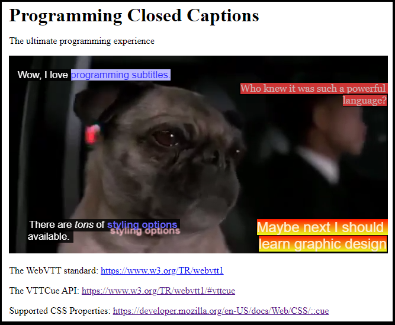

# WebVTT Captions Programming

Did you know that HTML video closed-captions and subtitles are customizable?



This project dives into the options available for the WebVTT closed caption format.

## Get Started
To run this project:

```bash
git clone <repo-url>
cd <repo-name>
npm install
npm start 

# instead of npm start, you can run this command:  
# node server.js

# When server is running, go to localhost:3000 in a browser.
```

# WebVTT Programming
At a basic level, the WebVTT (Web Video Text Tracks) format connects the HTML5 `<video>` tag to a `<track>` element. Captions in VTT format can be generated using various [speech recognition tools](https://github.com/ggerganov/whisper.cpp). WebVTT captions are served by a web server, hence the need for a simple running server when testing any caption modifications.


In HTML, VTT captions can be integrated into a video by way of the `<video>` tag: 

```html
<!-- Either invocation works -->
<video controls src="./MIB2.mp4">
    <track default kind="captions" srclang="en-US" src="./MIB2.vtt" />
</video>

<!-- But some browsers prefer this format -->
<video controls>
    <source type='video/mp4' src="./MIB2.mp4">
    <track default kind="captions" srclang="en-US" src="./MIB2.vtt" />
</video>
```

A basic `.vtt` file looks like this: 

```
WEBVTT 

00:00:00.000 --> 00:00:05.500
 Go on now, go! Walk out the door!

00:00:05.500 --> 00:00:08.320
 Just turn around now

00:00:08.320 --> 00:00:15.000
 'Cause you're not welcome anymore
```


A VTT file starts with the string `WEBVTT` and one or more empty lines. Then, **cue blocks** (delineated with an empty line) define the **cue timing** (`00:00:00.000 --> 00:00:05.500`) and a **cue payload** (`Go on now, go! Walk out the door!`) for the timing and the content of the captions over the video.

But, very relevant to our artistic ambitions, the VTT format also supports in-line **cue settings**, **region blocks**, and **style blocks**, which allow you to take advantage of most of the style elements available to the CSS pseudo-element [::cue](https://developer.mozilla.org/en-US/docs/Web/CSS/::cue). VTT also supports external style blocks and comments.

So we can take our plain captions and begin to style them.

## Styling with Cue settings
[Cue Settings](https://www.w3.org/TR/webvtt1/#cue-settings) are limited configuration options regarding the position and alignment of the cue box and the cue text within. They include `line`, `position`, `size`, `align`, and `region`. We will discuss `region` later.

Cue settings are added right after the cue timings, like so:

```
WEBVTT 

00:00:01.400 --> 00:00:20.640 line:1 align:left position:2% size:50%
*Singing* And I learned to get along 

00:00:03.000 --> 00:00:20.640 line:2 align:right position:100% size:50% 
 And so you're back. From outer space

00:00:06.500 --> 00:00:20.640 line:90 align:left position:5% size:50%
 I just walked in to find you here with that sad look upon your face

00:00:10.320 --> 00:00:20.640 line:90 align:right position:100% size:40% 
 I should have changed that stupid lock
```
When we let the video play, we see these captions display like so:


Briefly:
- `line` determines the height of the caption. 
  - `line:1` means 1 unit below the top (it doesn't seem like 1%, but maybe it is).
  - `line:90` means 90 units (probably 90%?) below the top. In the above screen cap, I should note that the display of low captions (captions near the bottom) are affected when you hover over the video and show the controls. They raise up above the controls and stay there.
- `align` controls the text alignment, so some examples are `align:left`, `align:right`, `align:center`.    
- `position` determines the indent of the cue box. 
  - Notice in the top left `*singing*` caption, that `position:2%`, and the bottom left `I just walked in` caption `position:5%`. The latter is a bit more indented than the former for this reason. 
  - The right side captions (`align:right`) each have `position:100%`, and therefore 0 indentation from the right. 
-  `size` is the proportion of the video (horizontally) that the cue box can take up. 
   -  If `size:100%`, it can extend the entire way across the screen.
   -  Notice the `I just walked in` caption has `size:50%` and creates a line break exactly at 50% of the screen (horizontally). 

## Styling with Style Blocks
This is where I see the power of VTT programming come to the fore. You can write CSS classes directly in the VTT instructions and reference them throughout the cue blocks. You mark a style block by writing `STYLE` on a line (where the line before it is empty), and then writing a CSS `::cue` pseudo-class. 

These classes can be added to the entire cue payload, or simply applied to particular words or phrases within the cue payload.

Take this simple example, which defines two `::cue` classes:

```
WEBVTT

STYLE
::cue(.topleft) {
  color: #201bff;
  background-color: #bbb9ff;
}

STYLE
::cue(.topright) {
  color: #ccb1b1;
  background-color: #cc3535;
  font-family: Georgia, serif;
}

00:00:01.400 --> 00:00:20.640 line:1 align:left position:2% size:50%
<c.topleft>*Singing* And I learned to get along</c> 

00:00:03.000 --> 00:00:20.640 line:2 align:right position:100% size:50% 
And so you're back. <c.topright>From outer space</c>
```
Which gives us the following captions:


The style classes are applied to the cue payloads by specifying: 
```
<c.classname> classy text </c>
```
As you can see in the above example, classes can be applied to all or some of the payload.

In VTT, the supported CSS properties conform mostly to the ::cue psudo-class supported properties. Although I'm not sure that the `background-image` property is supported. More information about ::cue properties here: <a href="https://developer.mozilla.org/en-US/docs/Web/CSS/::cue">https://developer.mozilla.org/en-US/docs/Web/CSS/::cue</a>.


## Style Block specials: `lang` and `voice` and embedded classes
There are two special classes (as far as I can tell) that also support styling: the `lang` tag and the `voice`, or `v`, tag. 
- I suppose the purpose behind the `lang` tag is to allow captions to support different languages within a video with one primary language. It's up to you, the caption artist, to decide how to represent a different language. 
- The `v` (or `voice`) tag is a cool feature but seems difficult to implement, even with machines producing the captions. It allows you to specify a caption style each time `Bob` speaks, for example, that could look completely different from whenever `Alice` speaks.  

These classes are called in a slightly different way than normal cue classes. Here's an example: 

```
WEBVTT

STYLE
::cue(lang[lang="en-GB"]) {
  color: cyan;
}
::cue([lang="en-US"]) { color: yellow; }
::cue(v[voice="Fred"]) { color: #e7b8c1; }
::cue(v[voice="Voicedude"]) { 
	color: #e7b8c1; 
	font-weight: bold;
	text-decoration: underline dotted white;
}
::cue(v[voice="Bill"]) { color: #b4a9e3; }


```
> **NOTE**: Remember how the first style block example said `STYLE` above each class (i.e., it said STYLE two times)? That is only required when separating classes with an empty line. If multiple classes are defined in series (with no empty lines), you don't have to declare `STYLE` multiple times. But Lord help you if you add in an extra empty line and don't redeclare `STYLE`!


## External Style Blocks
```
video::cue(.graphicDesignIsMyPassion) {
	font-size: 1.5rem;
	color: #ffe687;
	background-color: #702963;
	opacity: 0.99;
	outline: thick double #32a1ce;
}
```


## Cue Regions
